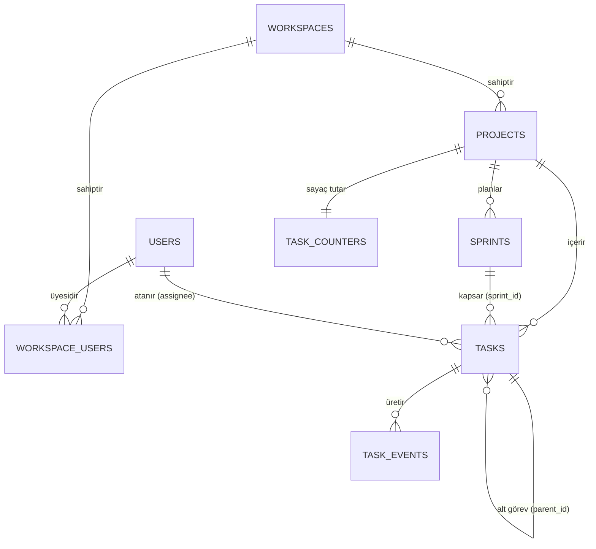

# Ar-Ge ve İş Takip Uygulaması - Veritabanı Şeması (v1.1)

Bu doküman, sistemin PostgreSQL tabanlı ilişkisel veritabanı mimarisini tanımlar. Sistem, "Shared Database, Shared Schema" (Paylaşımlı Veritabanı, Paylaşımlı Şema) çoklu kiracı (multi-tenant) mimarisine dayanmaktadır.

> **v1.1 Değişiklikleri:** Sprint bazlı metrik hesaplamaları (Velocity) için `sprints` tablosu ve `tasks.sprint_id` kolonu eklendi. `task_number` üretimindeki race condition'ı önlemek için `task_counters` atomik sayaç tablosu eklendi.

## 1. Varlık-İlişki (ER) Diyagramı

2. Tablo Detayları
2.1. workspaces (Çalışma Alanları)
Her bir şirket veya organizasyonu temsil eder. Tüm veri izolasyonunun tepe noktasıdır.

| Kolon Adı | Veri Tipi | Kısıtlamalar (Constraints) | Açıklama |
| :--- | :--- | :--- | :--- |
| id | UUID | PRIMARY KEY | Benzersiz çalışma alanı kimliği (UUIDv7 önerilir). |
| name | VARCHAR(100) | NOT NULL | Organizasyon adı (Örn: "Acme Corp"). |
| plan_type | VARCHAR(20) | NOT NULL, DEFAULT 'free' | Abonelik planı (free, premium, enterprise). |
| created_at | TIMESTAMPTZ | NOT NULL, DEFAULT NOW() | Oluşturulma zamanı. |
2.2. users (Kullanıcılar)
Sisteme kayıtlı tüm bireysel kullanıcılar. Bir kullanıcı birden fazla workspace'e dahil olabilir.

| Kolon Adı | Veri Tipi | Kısıtlamalar | Açıklama |
| :--- | :--- | :--- | :--- |
| id | UUID | PRIMARY KEY | Benzersiz kullanıcı kimliği. |
| email | VARCHAR(255) | UNIQUE, NOT NULL | Kullanıcı e-posta adresi. |
| password_hash | VARCHAR(255) | NOT NULL | Şifrelenmiş parola (Bcrypt/Argon2). |
| full_name | VARCHAR(100) | NOT NULL | Kullanıcının tam adı. |
2.3. workspace_users (Yetkilendirme / Pivot Tablo)
Kullanıcıların hangi çalışma alanlarında, hangi rollerle bulunduğunu tutar.

| Kolon Adı | Veri Tipi | Kısıtlamalar | Açıklama |
| :--- | :--- | :--- | :--- |
| workspace_id | UUID | PK, FK -> workspaces(id) | Çalışma alanı referansı. |
| user_id | UUID | PK, FK -> users(id) | Kullanıcı referansı. |
| role | VARCHAR(50) | NOT NULL | Rol (admin, manager, developer, viewer). |

(Not: workspace_id ve user_id birlikte Composite Primary Key oluşturur.)

2.4. projects (Projeler)
Çalışma alanı içindeki farklı ürünleri veya takımları temsil eder.

| Kolon Adı | Veri Tipi | Kısıtlamalar | Açıklama |
| :--- | :--- | :--- | :--- |
| id | UUID | PRIMARY KEY | Proje kimliği. |
| workspace_id | UUID | FK -> workspaces(id) | İzolasyon için zorunlu alan. |
| key | VARCHAR(10) | NOT NULL | Görev ön eki (Örn: "ENG", "MKT"). |
| name | VARCHAR(100) | NOT NULL | Proje adı. |

(İndeks: workspace_id ve key üzerinde Unique Composite Index.)

2.5. sprints (Sprintler / İterasyonlar) — YENİ (v1.1)
Velocity gibi metrikler tanımı gereği sprint bazlıdır; bu tablo olmadan "takım velocity'si" hesaplanamaz (Bkz. `PHASE_3_DETAILED_DESIGN.md`). Kanban ile çalışan takımlar bu tabloyu kullanmayabilir; `tasks.sprint_id` bu nedenle NULLABLE'dır.

| Kolon Adı | Veri Tipi | Kısıtlamalar | Açıklama |
| :--- | :--- | :--- | :--- |
| id | UUID | PRIMARY KEY | Sprint kimliği. |
| workspace_id | UUID | FK -> workspaces(id), NOT NULL | Multi-tenant izolasyon anahtarı (RLS'e tabidir). |
| project_id | UUID | FK -> projects(id), NOT NULL | Bağlı olduğu proje. |
| name | VARCHAR(100) | NOT NULL | Sprint adı (Örn: "Sprint 24.07"). |
| goal | TEXT | NULLABLE | Sprint hedefi. |
| status | VARCHAR(20) | NOT NULL, DEFAULT 'planned' | Durum (planned, active, completed). |
| start_date | DATE | NOT NULL | Başlangıç tarihi. |
| end_date | DATE | NOT NULL, CHECK (end_date > start_date) | Bitiş tarihi. |
| created_at | TIMESTAMPTZ | NOT NULL, DEFAULT NOW() | Oluşturulma zamanı. |

(İndeks: `project_id + status` üzerinde B-Tree. İş kuralı: Bir projede aynı anda en fazla bir `active` sprint olabilir — bu kural Partial Unique Index ile DB seviyesinde garanti edilir: `CREATE UNIQUE INDEX one_active_sprint ON sprints(project_id) WHERE status = 'active';`)

2.6. task_counters (Görev Numarası Sayacı) — YENİ (v1.1)
`task_number` üretimindeki race condition'ı önleyen atomik sayaç tablosu. Her proje için tek satır tutulur ve numara üretimi `UPDATE ... RETURNING` ile satır kilidi altında yapılır (Detaylı akış: `PHASE_1_DETAILED_DESIGN.md`, Bölüm 6).

| Kolon Adı | Veri Tipi | Kısıtlamalar | Açıklama |
| :--- | :--- | :--- | :--- |
| project_id | UUID | PRIMARY KEY, FK -> projects(id) | Proje başına tek sayaç satırı. |
| last_number | INTEGER | NOT NULL, DEFAULT 0 | Son üretilen görev numarası. |

(Not: Proje oluşturulurken aynı transaction içinde `(project_id, 0)` kaydı eklenir. Bu tabloya asla `SELECT` ile numara okunup uygulamada artırılmaz; tek geçerli erişim yolu `UPDATE task_counters SET last_number = last_number + 1 WHERE project_id = ? RETURNING last_number;` komutudur.)

2.7. tasks (Görevler)
İş takibinin merkez tablosudur. Hiyerarşik yapı ve esnek alanlar içerir.

| Kolon Adı | Veri Tipi | Kısıtlamalar | Açıklama |
| :--- | :--- | :--- | :--- |
| id | UUID | PRIMARY KEY | Görev kimliği. |
| workspace_id | UUID | FK -> workspaces(id) | Multi-tenant izolasyon anahtarı. |
| project_id | UUID | FK -> projects(id) | Bağlı olduğu proje. |
| sprint_id | UUID | FK -> sprints(id), NULLABLE | **(YENİ)** Görevin atandığı sprint. Backlog'daki veya Kanban görevlerinde NULL'dır. |
| parent_task_id | UUID | FK -> tasks(id), NULLABLE | Alt görevler (Sub-task) için self-referencing. |
| task_number | INTEGER | NOT NULL | Proje içi artan numara (Örn: ENG-101). `task_counters` üzerinden atomik üretilir. |
| title | VARCHAR(255) | NOT NULL | Görev başlığı. |
| status | VARCHAR(50) | NOT NULL | Durum (To Do, In Progress, Review, Done). |
| assignee_id | UUID | FK -> users(id), NULLABLE | Atanan kişi. |
| custom_fields | JSONB | NULLABLE | Takıma özel dinamik alanlar (Story Point vb.). |
| created_at | TIMESTAMPTZ | NOT NULL, DEFAULT NOW() | Oluşturulma tarihi. |
| updated_at | TIMESTAMPTZ | NOT NULL, DEFAULT NOW() | Son güncellenme tarihi. |

(İndeksler: project_id + task_number (Unique), workspace_id, assignee_id, **sprint_id (YENİ)**, custom_fields (GIN Index).)

2.8. task_events (Olay Tarihçesi / Analitik Verisi)
Görevler üzerindeki her değişikliğin (durum değişimi, atama, **sprint'e ekleme/çıkarma** vb.) loglandığı, analitik metriklerin (Cycle Time vb.) hesaplandığı append-only (sadece ekleme yapılan) tablodur.

| Kolon Adı | Veri Tipi | Kısıtlamalar | Açıklama |
| :--- | :--- | :--- | :--- |
| id | UUID | PRIMARY KEY | Olay kimliği. |
| task_id | UUID | FK -> tasks(id) | İlgili görev. |
| actor_id | UUID | FK -> users(id) | Değişikliği yapan kullanıcı. |
| event_type | VARCHAR(50) | NOT NULL | Olay tipi (status_changed, assigned, sprint_changed vb.). |
| old_value | JSONB | NULLABLE | Değişiklik öncesi durum. |
| new_value | JSONB | NULLABLE | Değişiklik sonrası durum. |
| created_at | TIMESTAMPTZ | NOT NULL, DEFAULT NOW() | Olayın gerçekleştiği zaman (Partition Key). |

(Not — Velocity için kritik kural: Sprint kapanırken görevin sprint'te olup olmadığı `tasks.sprint_id`'nin **o anki** değerinden değil, `task_events`'teki `sprint_changed` tarihçesinden türetilir. Böylece "sprint bittikten sonra görevi başka sprint'e taşıma" geçmiş sprint'in velocity'sini bozamaz.)

3. Kritik İndeksleme Stratejileri
JSONB GIN İndeksi: tasks.custom_fields üzerinde GIN (Generalized Inverted Index) kullanılarak, dinamik alanlarda hızlı arama yapılması sağlanacaktır.
B-Tree İndeksleri: Yabancı anahtarlar (Foreign Keys) ve sık filtrelenen status, created_at gibi kolonlar B-Tree ile indekslenmiştir. İndeks arama karmaşıklığı O(logN) seviyesinde tutularak milyonlarca satırda bile milisaniyelik yanıtlar hedeflenmiştir.

### ⚖️ Trade-off (Ödünleşim) Analizi
* **UUID vs. Auto-Increment (Serial) Integer:** Tablolarda Primary Key olarak UUID (Özellikle zaman sıralı UUIDv7) kullanmayı tercih ettik. **Avantajı:** Dağıtık sistemlerde (farklı mikroservisler veya veritabanı shard'ları) çakışma riski olmadan ID üretilebilir ve güvenlik açısından ID'ler tahmin edilemez (Örn: `tasks/1` yerine `tasks/a3f8...`). **Dezavantajı:** UUID'ler 16 byte yer kaplar (Integer 4 byte'tır). Bu durum indeks boyutlarını büyütür ve bellek (RAM) kullanımını artırır. Ancak B2B SaaS sistemlerinde güvenlik ve dağıtık mimari uyumluluğu, disk/bellek maliyetinden daha önemlidir.
* **Soft Delete (Silinmiş gibi gösterme) vs. Hard Delete (Gerçekten silme):** Şemada `deleted_at` kolonu eklemedim. Soft delete, analitik verilerin tutarlılığını korur ancak her sorguya `WHERE deleted_at IS NULL` eklemeyi gerektirir ve indeksleri şişirir. Bunun yerine, silinen görevleri asenkron bir worker ile "Cold Storage" (Soğuk Depolama - S3 veya ayrı bir arşiv veritabanı) alanına taşıyan bir **Event-Driven Archiving** (Olay Güdümlü Arşivleme) yaklaşımı öneriyorum.
* **Sprint'i Ayrı Tablo Yapmak vs. `custom_fields` (JSONB) İçinde Tutmak:** Sprint bilgisi `custom_fields` içine `{"sprint": "24.07"}` gibi gömülebilirdi ve şema değişikliği gerektirmezdi. Ancak Velocity hesaplaması sprint'in **tarih aralığına** ve **kapanma anına** bağlıdır; JSONB içindeki serbest metin üzerinden tarih aralığı JOIN'lemek hem yavaş hem hataya açıktır. Sprint, üzerinde iş kuralları (tek aktif sprint, tarih doğrulaması) çalışan gerçek bir domain varlığıdır ve ilişkisel tablo hak eder. `custom_fields`, iş kuralı taşımayan gerçekten serbest alanlar (Örn: "Müşteri Talebi No") için saklanmalıdır.

### 🚀 Mimari İpucu
**PostgreSQL Row-Level Security (RLS) Kullanımı:** Multi-tenant (Çoklu kiracı) sistemlerde en büyük kabus, yazılımdaki bir bug yüzünden A şirketinin B şirketine ait görevleri görmesidir (Data Leakage). Bunu uygulama katmanında (Backend kodunda) çözmek yerine, veritabanı katmanında çözün. PostgreSQL'in **RLS (Satır Bazlı Güvenlik)** özelliğini aktif ederek, her veritabanı oturumunda (session) geçerli `workspace_id`'yi set edin. Böylece bir geliştirici kodda `SELECT * FROM tasks` yazsa bile, veritabanı motoru otomatik olarak sadece o anki müşteriye ait satırları döndürür. Bu, sisteminizin güvenliğini aşılmaz bir seviyeye taşır. (Yeni eklenen `sprints` tablosu da `workspace_id` kolonu taşıdığı için aynı RLS politikasına dahil edilmelidir. `task_counters` tablosunda `workspace_id` yoktur; bu tabloya erişim yalnızca `projects` üzerinden, RLS'ten geçmiş bir `project_id` ile yapıldığından izolasyon dolaylı olarak korunur.)
